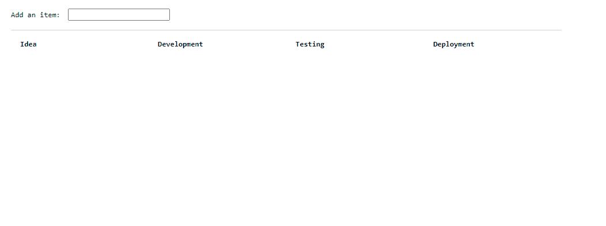

# Getting Started with Create React App

This project was bootstrapped with [Create React App](https://github.com/facebook/create-react-app).

## Available Scripts

In the project directory, you can run:

### `npm start`

Runs the app in the development mode.\
Open [http://localhost:3000](http://localhost:3000) to view it in your browser.

The page will reload when you make changes.\
You may also see any lint errors in the console.

### `npm test`

Launches the test runner in the interactive watch mode.\
See the section about [running tests](https://facebook.github.io/create-react-app/docs/running-tests) for more information.

### `User Guide`
create task manager.
imagine we have 4 stage such as: 'Idea', 'Development', 'Testing', 'Deployment'.
Acceptance Criteria:
1. Adding an item in the Idea column with 'enter' key. 
2. New items should add to the top of the list in each column.
3. through click on each item move to the next column.
4. right-click on each item, move to the previous column and add it to the end of the list. 
5. through click on each item in the 'Deployment' column, the item should be removed and exits from the board.
6. through right-click on each item in the 'Idea' column, the item should be removed and exits from the board.  

### `Demo`:
